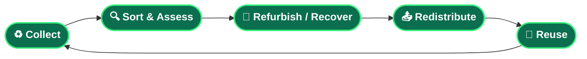

<!--
============================================================
  SURESH GRANDHI · EXECUTIVE GITHUB PROFILE README
  Ready to publish. Paste into the repo: suri4uall2026/suri4uall2026
  (Optional) Featured-repo links assume repos under github.com/suri4uall2026/
============================================================
-->

<!-- ====================== HERO BANNER ====================== -->

<!-- ====================== TYPING HEADER ====================== -->

 

&nbsp;

&nbsp;

<!-- ====================== EXECUTIVE SUMMARY ====================== -->

<h2>🧭 Executive Summary</h2>

> I lead the strategy, design, and delivery of **sustainability technology platforms** that turn environmental responsibility into operating systems people actually use — across municipalities, retailers, collection partners, and citizens.

With **18+ years** spanning product management, program leadership, and digital transformation, I sit at the intersection of **business strategy and hands-on execution**. I shape product vision, translate complex requirements into clean workflows, align cross-functional teams, and ship platforms that move real-world metrics — devices recovered, materials recycled, routes optimized, and emissions avoided.

My work centers on a simple conviction: **technology should solve business problems *and* contribute to a more sustainable future.** I build the systems that make the circular economy operational at scale — reverse logistics, resource recovery, e-waste management, and sustainable commerce.

`Product Strategy` · `Program Leadership` · `Digital Transformation` · `Sustainability Innovation` · `Circular Economy Platforms`

<!-- ====================== IMPACT DASHBOARD ====================== -->

<h2>📊 Impact Dashboard</h2>

<table width="100%">
  <tr>
    <td align="center" width="33%">
      <h1>🗓️ 18+</h1>
      <b>Years of Experience</b> 
      Product · Program · Delivery
    </td>
    <td align="center" width="33%">
      <h1>🧩 4+</h1>
      <b>Platforms Delivered</b> 
      End-to-end ownership
    </td>
    <td align="center" width="33%">
      <h1>♻️ Multiple</h1>
      <b>Circular Economy Initiatives</b> 
      Collection to recovery
    </td>
  </tr>
  <tr>
    <td align="center" width="33%">
      <h1>🌱 Ongoing</h1>
      <b>Sustainability Programs</b> 
      Measurable impact
    </td>
    <td align="center" width="33%">
      <h1>📱 Multi-OS</h1>
      <b>Mobile Ecosystems Built</b> 
      Android · iOS · Flutter
    </td>
    <td align="center" width="33%">
      <h1>👥 Cross-Functional</h1>
      <b>Teams Led</b> 
      Design · Eng · Ops · Vendors
    </td>
  </tr>
</table>

<!-- ====================== PRODUCT PORTFOLIO ====================== -->

<h2>🚀 Product Portfolio</h2>

<table width="100%">
  <tr>
    <td width="50%" valign="top">
      <h3>♻️ ReXtract</h3>
      <i>Extract. Reuse. Sustain.</i>
      
A sustainability platform powering responsible recycling, device exchange, pickup services, environmental impact tracking, rewards, and sustainable commerce — the operating layer for circular economy initiatives.

      <b>Impact:</b> Turns recycling into a guided, rewarded, trackable experience for citizens and municipalities.
    </td>
    <td width="50%" valign="top">
      <h3>🔄 Xchange</h3>
      <i>Trade-in, reimagined.</i>
      
A retail trade-in and exchange ecosystem connecting consumers, retailers, collection partners, and recyclers into a single value-recovery network.

      <b>Impact:</b> Unlocks residual device value and extends product lifecycles across the retail chain.
    </td>
  </tr>
  <tr>
    <td width="50%" valign="top">
      <h3>📦 LetsCollect</h3>
      <i>Field operations, in motion.</i>
      
A field operations and reverse-logistics platform supporting resource recovery and collection — crew workflows, geofenced completion, live pricing, and payment.

      <b>Impact:</b> Brings structure, traceability, and accountability to last-mile collection.
    </td>
    <td width="50%" valign="top">
      <h3>👤 HRIS EasyCheck</h3>
      <i>People operations, simplified.</i>
      
A workforce management and employee-engagement platform streamlining attendance, records, and day-to-day people operations.

      <b>Impact:</b> Reduces administrative overhead and improves workforce visibility.
    </td>
  </tr>
</table>

<b>📈 Business impact at a glance</b>

 

- **ReXtract** — converts environmental compliance into an engaging, rewards-driven recycling journey, giving municipalities and bulk waste generators measurable recovery and reporting.
- **Xchange** — captures value that would otherwise be lost, aligning consumer incentives with retailer and recycler economics.
- **LetsCollect** — replaces manual, opaque collection with GPS-aware, payment-integrated, auditable field operations.
- **HRIS EasyCheck** — frees operational teams from manual people-ops, improving accuracy and time-to-decision.

<!-- ====================== LEADERSHIP AREAS ====================== -->

<h2>🎯 Leadership Areas</h2>

 

<b>🧠 Full core expertise</b>

 

| Strategy & Product | Delivery & Operations | Relationships & Process |
| :--- | :--- | :--- |
| Product Management | Agile Delivery | Stakeholder Management |
| Program Management | Solution Design | Vendor Management |
| Product Roadmapping | Platform Integrations | Process Optimization |
| Mobile Product Strategy | Business Analysis | Team Leadership |
| Digital Transformation | Sustainability Platforms | Circular Economy Solutions |

<!-- ====================== SUSTAINABILITY ====================== -->

<h2>🌍 Sustainability at the Core</h2>

> ### *"Technology should not only solve business problems but also contribute to a more sustainable future."*

Every platform I lead is built to close the loop — keeping materials, devices, and value in circulation instead of in landfills. The model is simple to describe and hard to operationalize, which is exactly where good product leadership earns its keep:

<!-- ====================== TECHNOLOGY ECOSYSTEMS ====================== -->

<h2>🛠️ Technology Ecosystems Led & Delivered</h2>

<i>Platforms and stacks I have directed from concept to production — owned as a leader, not authored as a single contributor.</i>

  

 

 

<!-- ====================== CAREER TIMELINE ====================== -->

<h2>🧱 Professional Journey</h2>

<b>Technology Delivery</b> → <b>Product Leadership</b> → <b>Digital Transformation</b> → <b>Sustainability Innovation</b> → <b>Circular Economy Platforms</b>

<!-- ====================== FEATURED REPOS ====================== -->

<h2>📌 Featured Work & Case Studies</h2>

<i>Recommended repositories to pin — replace links with your own once created.</i>

 

| Repository | What it showcases |
| :--- | :--- |
| 🌱 [`sustainability-platforms`](https://github.com/suri4uall2026/sustainability-platforms) | The thesis behind building tech for environmental and social impact. |
| ♻️ [`rextract`](https://github.com/suri4uall2026/rextract) | Architecture and product story of the flagship recycling platform. |
| 🔄 [`xchange`](https://github.com/suri4uall2026/xchange) | The retail trade-in and value-recovery ecosystem. |
| 📦 [`letscollect`](https://github.com/suri4uall2026/letscollect) | Field operations and reverse-logistics workflows. |
| 📝 [`product-case-studies`](https://github.com/suri4uall2026/product-case-studies) | Decisions, trade-offs, and outcomes across launches. |
| 🚀 [`digital-transformation`](https://github.com/suri4uall2026/digital-transformation) | Modernization playbooks and transformation patterns. |
| 🗺️ [`product-roadmaps`](https://github.com/suri4uall2026/product-roadmaps) | How vision becomes sequenced, shippable strategy. |
| 🏛️ [`solution-architecture`](https://github.com/suri4uall2026/solution-architecture) | System design and integration blueprints. |
| 🔬 [`sustainability-research`](https://github.com/suri4uall2026/sustainability-research) | Notes and research underpinning circular-economy products. |

<!-- ====================== CONNECT ====================== -->

<h2>🤝 Let's Build Something That Matters</h2>

<!-- ====================== FOOTER ====================== -->

