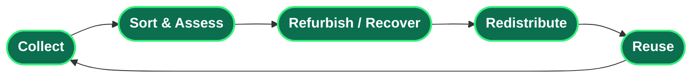

<!--
============================================================
  SURESH GRANDHI · EXECUTIVE GITHUB PROFILE README
  Ready to publish. Paste into the repo: suri4uall2026/suri4uall2026
  Contact links are filled. Personal details (address, phone, DOB)
  are intentionally left OFF a public profile.
============================================================
-->

<!-- ====================== HERO BANNER ====================== -->

### Product Manager · Program Leader · FinTech & Sustainability Technology

<!-- ====================== TYPING HEADER ====================== -->

 

&nbsp;

&nbsp;

<!-- ====================== EXECUTIVE SUMMARY ====================== -->

<h2>🧭 Executive Summary</h2>

> I lead the strategy, design, and delivery of digital products across **mobile banking, retail commerce, and sustainability technology** — turning complex business problems into platforms used at national scale.

Over **18+ years**, my path has run from hands-on engineering to enterprise delivery management to **product and program leadership**. Today I lead **sustainability and circular-economy platforms at Loop (LetsLoop)** — ReXtract, Xchange, and LetsCollect — that operationalize responsible recycling, device exchange, and reverse logistics for retailers, municipalities, and citizens.

Most recently in fintech, I managed product for **iMobile Pay at ICICI Bank** — one of India's most comprehensive and secure mobile banking applications, offering 170+ services — leading a 40+ member cross-functional team through the full agile lifecycle.

My conviction is simple: **technology should solve real business problems *and* contribute to a more sustainable future** — and **AI** is the lever I use to get there faster, embedding it directly into both the products I ship and how my teams work.

`AI-Driven Products` · `Product Management` · `Program Leadership` · `Agile / Scrum` · `FinTech` · `Circular Economy`

<!-- ====================== IMPACT DASHBOARD ====================== -->

<h2>📊 Impact Dashboard</h2>

<table width="100%">
  <tr>
    <td align="center" width="33%">
      <h1>🧩 9+</h1>
      <b>Products Owned End-to-End</b> 
      Vision → design → launch → scale
    </td>
    <td align="center" width="33%">
      <h1>🏦 170+</h1>
      <b>Banking Services Shipped</b> 
      iMobile Pay · ICICI Bank
    </td>
    <td align="center" width="33%">
      <h1>🗓️ 18+</h1>
      <b>Years of Experience</b> 
      Engineering → Product → Leadership
    </td>
  </tr>
  <tr>
    <td align="center" width="33%">
      <h1>👥 40+</h1>
      <b>Cross-Functional Team Led</b> 
      Dev · QA · App Owners
    </td>
    <td align="center" width="33%">
      <h1>🏅 5+</h1>
      <b>Certifications & Credentials</b> 
      PSPO I · CSM · MCP · AI workshops
    </td>
    <td align="center" width="33%">
      <h1>🏆 4×</h1>
      <b>Best Employee Awards</b> 
      Recognized for delivery impact
    </td>
  </tr>
</table>

<!-- ====================== AI-DRIVEN INNOVATION (PRIORITY) ====================== -->

<h2>🤖 AI-Driven Innovation</h2>

> **AI is central to how I build.** I treat it as a first-class capability — embedded in the products I ship and in how my teams discover, design, and deliver.

- 🧠 **AI-powered classification in production** — integrated **Google Gemini** vision models to automatically detect and categorize recyclable and e-waste items, replacing manual sorting with instant, accurate recognition across the sustainability platforms.
- ⚡ **AI-accelerated delivery** — generative AI woven into requirement analysis, rapid prototyping, UX iteration, and documentation, compressing discovery-to-delivery cycles.
- 🧩 **AI-first product thinking** — designing features around what models do well, from intelligent valuation to automated quality checks.
- 📚 **Continuous learning** — hands-on **workshops, bootcamps, and certifications** to stay at the frontier of AI and product practice.

<b>🎟️ Workshops, bootcamps & certificates</b>

 

<!-- Send me the exact names/issuers/years and I'll replace these examples. -->
<!--- _[Workshop / Bootcamp name]_ — _[Issuer]_, _[Year]_
- _[AI / Product certificate]_ — _[Issuer]_, _[Year]_
- _[Workshop / Bootcamp name]_ — _[Issuer]_, _[Year]_-->

<!-- ====================== CAREER JOURNEY ====================== -->

<h2>🧱 Professional Journey</h2>

| Period | Organization | Role | Focus |
| :--- | :--- | :--- | :--- |
| **Oct 2023 – Present** | **Loop Sustainability (LetsLoop)** | Product & Platform Lead | ReXtract · Xchange · LetsCollect — sustainability & circular economy |
| **Feb 2023 – Oct 2023** | **ICICI Bank** | Product Manager | iMobile Pay — mobile banking; 170+ services; 40+ member team |
| **2022 – 2023** | **Capgemini** | Senior Consultant *(Product Owner / Scrum Master)* | MRM pricing data-warehouse for banking markets |
| **2017 – 2022** | **Ikon Technologies** | Manager – Product & Technology | Retail exchange, buy-back, ERP · *Best Employee ×4* |
| **2010 – 2017** | **HCL Services** | Service Manager *(Helpdesk / Delivery)* | Govt programs — Naval Command, State Taxes (3.9L dealers) |
| **2006 – 2010** | **GrayMatter · softProjex · Prem Technologies** | Software Engineer (.NET) | Application design & development |

<!-- ====================== PRODUCT PORTFOLIO ====================== -->

<h2>🚀 Product Portfolio</h2>

### 🌱 Sustainability & Circular-Economy Suite *(Loop / LetsLoop)*
The products I own end-to-end today — built to keep devices, materials, and value in circulation.

<table width="100%">
  <tr>
    <td width="50%" valign="top">
      <h3>♻️ ReXtract</h3>
      <i>Extract. Reuse. Sustain.</i>
      
A sustainability platform powering responsible recycling, device exchange, pickup services, environmental impact tracking, rewards, and sustainable commerce.

      <b>Impact:</b> Turns recycling into a guided, rewarded, trackable experience for citizens and municipalities.
    </td>
    <td width="50%" valign="top">
      <h3>🔄 Xchange</h3>
      <i>Trade-in, reimagined.</i>
      
A retail trade-in and exchange ecosystem connecting consumers, retailers, collection partners, and recyclers — algorithm-driven device valuation at scale.

      <b>Impact:</b> Unlocks residual device value across <b>1000+ retail outlets</b> and extends product lifecycles.
    </td>
  </tr>
  <tr>
    <td width="50%" valign="top">
      <h3>📦 LetsCollect</h3>
      <i>Field operations, in motion.</i>
      
A field operations and reverse-logistics platform supporting resource recovery — crew workflows, geofenced completion, live pricing, and payment.

      <b>Impact:</b> Brings structure, traceability, and accountability to last-mile collection.
    </td>
    <td width="50%" valign="top">
      <h3>👤 HRIS EasyCheck</h3>
      <i>People operations, simplified.</i>
      
A workforce management and employee-engagement platform streamlining attendance, records, and day-to-day people operations.

      <b>Impact:</b> Reduces administrative overhead and improves workforce visibility.
    </td>
  </tr>
</table>

 

### 🏦 FinTech Flagship — iMobile Pay *(ICICI Bank)*
One of India's most comprehensive and secure mobile banking platforms — **170+ services**, payments over a unified interface, delivered with a 40+ member cross-functional team across the full agile lifecycle.

<b>📈 Earlier flagship platforms (Ikon Technologies)</b>

 

- **LFR Exchange System** — device trade-in across 1000+ retail outlets, 500+ devices/day, with a custom valuation algorithm.
- **Assured Buy-Back System** — guaranteed buy-back pricing layered onto the exchange platform.
- **Sales Order Management** — bulk vendor ordering with analytics feeding the valuation engine.
- **ERP – Business Process Platform** — centralized backbone linking exchange, buy-back, orders, QC, and service/spares.

<!-- ====================== LEADERSHIP AREAS ====================== -->

<h2>🎯 Leadership Areas</h2>

 

<b>🧠 Full core expertise</b>

 

| Strategy & Product | Delivery & Operations | Relationships & Process |
| :--- | :--- | :--- |
| Product Management | Agile / Scrum / Kanban | Stakeholder Management |
| Program Management | Release Management | Vendor Management |
| Product Roadmapping | Solution Design | Process Optimization |
| Business Analysis (BRS) | Configuration Management | Team Hiring & Mentoring |
| Mobile Product Strategy | Quality Management | Budget & Cost Management |

<!-- ====================== EDUCATION & CERTIFICATIONS ====================== -->

<h2>🎓 Education & Certifications</h2>

<table width="100%">
  <tr>
    <td width="50%" valign="top">
      <h3>📚 Education</h3>
      <ul>
        <li><b>MBA, Human Resource Management</b> Sikkim Manipal University · 2011</li>
        <li><b>B.Tech, Information Technology</b> JNTU Hyderabad (STIET) · 2006</li>
      </ul>
    </td>
    <td width="50%" valign="top">
      <h3>🏅 Certifications</h3>
      <ul>
        <li><b>Professional Scrum Product Owner I</b> (PSPO I) — Scrum.org</li>
        <li><b>Certified ScrumMaster</b> (CSM) — Scrum Alliance</li>
        <li><b>Microsoft Certified Professional</b> (C#) — Microsoft</li>
      </ul>
    </td>
  </tr>
</table>

<h2>🌍 Sustainability at the Core</h2>

> ### *"Technology should not only solve business problems but also contribute to a more sustainable future."*

Every sustainability platform I lead is built to close the loop — keeping materials, devices, and value in circulation instead of in landfills. Simple to describe, hard to operationalize — which is exactly where product leadership earns its keep:

<!-- ====================== TECHNOLOGY ECOSYSTEMS ====================== -->

<h2>🛠️ Platforms, Tools & Ecosystems</h2>

<i>Technology and delivery ecosystems I have led from concept to production — directed as a leader, across teams.</i>

  

 

 

<!-- ====================== FEATURED REPOS ====================== -->

<h2>📌 Featured Work & Case Studies</h2>

<i>Recommended repositories to pin — create them and these links light up.</i>

 

| Repository | What it showcases |
| :--- | :--- |
| 🌱 [`sustainability-platforms`](https://github.com/suri4uall2026/sustainability-platforms) | The thesis behind building tech for environmental and social impact. |
| ♻️ [`rextract`](https://github.com/suri4uall2026/rextract) | Architecture and product story of the flagship recycling platform. |
| 🔄 [`xchange`](https://github.com/suri4uall2026/xchange) | The retail trade-in and value-recovery ecosystem. |
| 📦 [`letscollect`](https://github.com/suri4uall2026/letscollect) | Field operations and reverse-logistics workflows. |
| 📝 [`product-case-studies`](https://github.com/suri4uall2026/product-case-studies) | Decisions, trade-offs, and outcomes across launches. |
| 🚀 [`digital-transformation`](https://github.com/suri4uall2026/digital-transformation) | Modernization playbooks and transformation patterns. |
| 🗺️ [`product-roadmaps`](https://github.com/suri4uall2026/product-roadmaps) | How vision becomes sequenced, shippable strategy. |
| 🏛️ [`solution-architecture`](https://github.com/suri4uall2026/solution-architecture) | System design and integration blueprints. |
| 🔬 [`sustainability-research`](https://github.com/suri4uall2026/sustainability-research) | Notes and research underpinning circular-economy products. |

<!-- ====================== CONNECT ====================== -->

<h2>🤝 Let's Build Something That Matters</h2>

<!-- ====================== FOOTER ====================== -->

### *"Building digital products that create value for businesses, communities, and the planet."*

<!--
============================================================
  SURESH GRANDHI · EXECUTIVE GITHUB PROFILE README
  Ready to publish. Paste into the repo: suri4uall2026/suri4uall2026
  Contact links are filled. Personal details (address, phone, DOB)
  are intentionally left OFF a public profile.
============================================================
-->

<!-- ====================== HERO BANNER ====================== -->

<!-- HERO NOTE: upload the provided assets/banner.png into an /assets folder in your repo so this displays.
     Prefer a zero-upload animated banner? Replace the  line above with the one below:

-->

### Product Manager · Program Leader · FinTech & Sustainability Technology

<!-- ====================== TYPING HEADER ====================== -->

 

&nbsp;

&nbsp;

<!-- ====================== EXECUTIVE SUMMARY ====================== -->

<h2>🧭 Executive Summary</h2>

> I lead the strategy, design, and delivery of digital products across **mobile banking, retail commerce, and sustainability technology** — turning complex business problems into platforms used at national scale.

Over **18+ years**, my path has run from hands-on engineering to enterprise delivery management to **product and program leadership**. Today I lead **sustainability and circular-economy platforms at Loop (LetsLoop)** — ReXtract, Xchange, and LetsCollect — that operationalize responsible recycling, device exchange, and reverse logistics for retailers, municipalities, and citizens.

Most recently in fintech, I managed product for **iMobile Pay at ICICI Bank** — one of India's most comprehensive and secure mobile banking applications, offering 170+ services — leading a 40+ member cross-functional team through the full agile lifecycle.

My conviction is simple: **technology should solve real business problems *and* contribute to a more sustainable future** — and **AI** is the lever I use to get there faster, embedding it directly into both the products I ship and how my teams work.

`AI-Driven Products` · `Product Management` · `Program Leadership` · `Agile / Scrum` · `FinTech` · `Circular Economy`

<!-- ====================== IMPACT DASHBOARD ====================== -->

<h2>📊 Impact Dashboard</h2>

<table width="100%">
  <tr>
    <td align="center" width="33%">
      <h1>🧩 9+</h1>
      <b>Products Owned End-to-End</b> 
      Vision → design → launch → scale
    </td>
    <td align="center" width="33%">
      <h1>🏦 170+</h1>
      <b>Banking Services Shipped</b> 
      iMobile Pay · ICICI Bank
    </td>
    <td align="center" width="33%">
      <h1>🗓️ 18+</h1>
      <b>Years of Experience</b> 
      Engineering → Product → Leadership
    </td>
  </tr>
  <tr>
    <td align="center" width="33%">
      <h1>👥 40+</h1>
      <b>Cross-Functional Team Led</b> 
      Dev · QA · App Owners
    </td>
    <td align="center" width="33%">
      <h1>🏅 5+</h1>
      <b>Certifications & Credentials</b> 
      PSPO I · CSM · MCP · AI workshops
    </td>
    <td align="center" width="33%">
      <h1>🏆 4×</h1>
      <b>Best Employee Awards</b> 
      Recognized for delivery impact
    </td>
  </tr>
</table>

<!-- ====================== AI-DRIVEN INNOVATION (PRIORITY) ====================== -->

<h2>🤖 AI-Driven Innovation</h2>

> **AI is central to how I build.** I treat it as a first-class capability — embedded in the products I ship and in how my teams discover, design, and deliver.

- 🧠 **AI-powered classification in production** — integrated **Google Gemini** vision models to automatically detect and categorize recyclable and e-waste items, replacing manual sorting with instant, accurate recognition across the sustainability platforms.
- ⚡ **AI-accelerated delivery** — generative AI woven into requirement analysis, rapid prototyping, UX iteration, and documentation, compressing discovery-to-delivery cycles.
- 🧩 **AI-first product thinking** — designing features around what models do well, from intelligent valuation to automated quality checks.
- 📚 **Continuous learning** — hands-on **workshops, bootcamps, and certifications** to stay at the frontier of AI and product practice.

<b>🎟️ Workshops, bootcamps & certificates</b>

 

<!-- Send me the exact names/issuers/years and I'll replace these examples. -->
- _[Workshop / Bootcamp name]_ — _[Issuer]_, _[Year]_
- _[AI / Product certificate]_ — _[Issuer]_, _[Year]_
- _[Workshop / Bootcamp name]_ — _[Issuer]_, _[Year]_

<!-- ====================== CAREER JOURNEY ====================== -->

<h2>🧱 Professional Journey</h2>

| Period | Organization | Role | Focus |
| :--- | :--- | :--- | :--- |
| **Oct 2023 – Present** | **Loop Sustainability (LetsLoop)** | Product & Platform Lead | ReXtract · Xchange · LetsCollect — sustainability & circular economy |
| **Feb 2023 – Oct 2023** | **ICICI Bank** | Product Manager | iMobile Pay — mobile banking; 170+ services; 40+ member team |
| **2022 – 2023** | **Capgemini** | Senior Consultant *(Product Owner / Scrum Master)* | MRM pricing data-warehouse for banking markets |
| **2017 – 2022** | **Ikon Technologies** | Manager – Product & Technology | Retail exchange, buy-back, ERP · *Best Employee ×4* |
| **2010 – 2017** | **HCL Services** | Service Manager *(Helpdesk / Delivery)* | Govt programs — Naval Command, State Taxes (3.9L dealers) |
| **2006 – 2010** | **GrayMatter · softProjex · Prem Technologies** | Software Engineer (.NET) | Application design & development |

<!-- ====================== PRODUCT PORTFOLIO ====================== -->

<h2>🚀 Product Portfolio</h2>

### 🌱 Sustainability & Circular-Economy Suite *(Loop / LetsLoop)*
The products I own end-to-end today — built to keep devices, materials, and value in circulation.

<table width="100%">
  <tr>
    <td width="50%" valign="top">
      <h3>♻️ ReXtract</h3>
      <i>Extract. Reuse. Sustain.</i>
      
A sustainability platform powering responsible recycling, device exchange, pickup services, environmental impact tracking, rewards, and sustainable commerce.

      <b>Impact:</b> Turns recycling into a guided, rewarded, trackable experience for citizens and municipalities.
    </td>
    <td width="50%" valign="top">
      <h3>🔄 Xchange</h3>
      <i>Trade-in, reimagined.</i>
      
A retail trade-in and exchange ecosystem connecting consumers, retailers, collection partners, and recyclers — algorithm-driven device valuation at scale.

      <b>Impact:</b> Unlocks residual device value across <b>1000+ retail outlets</b> and extends product lifecycles.
    </td>
  </tr>
  <tr>
    <td width="50%" valign="top">
      <h3>📦 LetsCollect</h3>
      <i>Field operations, in motion.</i>
      
A field operations and reverse-logistics platform supporting resource recovery — crew workflows, geofenced completion, live pricing, and payment.

      <b>Impact:</b> Brings structure, traceability, and accountability to last-mile collection.
    </td>
    <td width="50%" valign="top">
      <h3>👤 HRIS EasyCheck</h3>
      <i>People operations, simplified.</i>
      
A workforce management and employee-engagement platform streamlining attendance, records, and day-to-day people operations.

      <b>Impact:</b> Reduces administrative overhead and improves workforce visibility.
    </td>
  </tr>
</table>

 

### 🏦 FinTech Flagship — iMobile Pay *(ICICI Bank)*
One of India's most comprehensive and secure mobile banking platforms — **170+ services**, payments over a unified interface, delivered with a 40+ member cross-functional team across the full agile lifecycle.

<b>📈 Earlier flagship platforms (Ikon Technologies)</b>

 

- **LFR Exchange System** — device trade-in across 1000+ retail outlets, 500+ devices/day, with a custom valuation algorithm.
- **Assured Buy-Back System** — guaranteed buy-back pricing layered onto the exchange platform.
- **Sales Order Management** — bulk vendor ordering with analytics feeding the valuation engine.
- **ERP – Business Process Platform** — centralized backbone linking exchange, buy-back, orders, QC, and service/spares.

<!-- ====================== LEADERSHIP AREAS ====================== -->

<h2>🎯 Leadership Areas</h2>

 

<b>🧠 Full core expertise</b>

 

| Strategy & Product | Delivery & Operations | Relationships & Process |
| :--- | :--- | :--- |
| Product Management | Agile / Scrum / Kanban | Stakeholder Management |
| Program Management | Release Management | Vendor Management |
| Product Roadmapping | Solution Design | Process Optimization |
| Business Analysis (BRS) | Configuration Management | Team Hiring & Mentoring |
| Mobile Product Strategy | Quality Management | Budget & Cost Management |

<!-- ====================== EDUCATION & CERTIFICATIONS ====================== -->

<h2>🎓 Education & Certifications</h2>

<table width="100%">
  <tr>
    <td width="50%" valign="top">
      <h3>📚 Education</h3>
      <ul>
        <li><b>MBA, Human Resource Management</b> Sikkim Manipal University · 2011</li>
        <li><b>B.Tech, Information Technology</b> JNTU Hyderabad (STIET) · 2006</li>
      </ul>
    </td>
    <td width="50%" valign="top">
      <h3>🏅 Certifications</h3>
      <ul>
        <li><b>Professional Scrum Product Owner I</b> (PSPO I) — Scrum.org</li>
        <li><b>Certified ScrumMaster</b> (CSM) — Scrum Alliance</li>
        <li><b>Microsoft Certified Professional</b> (C#) — Microsoft</li>
      </ul>
    </td>
  </tr>
</table>

<h2>🌍 Sustainability at the Core</h2>

> ### *"Technology should not only solve business problems but also contribute to a more sustainable future."*

Every sustainability platform I lead is built to close the loop — keeping materials, devices, and value in circulation instead of in landfills. Simple to describe, hard to operationalize — which is exactly where product leadership earns its keep:

<!-- ====================== TECHNOLOGY ECOSYSTEMS ====================== -->

<h2>🛠️ Platforms, Tools & Ecosystems</h2>

<i>Technology and delivery ecosystems I have led from concept to production — directed as a leader, across teams.</i>

  

 

 

<!-- ====================== FEATURED REPOS ====================== -->

<h2>📌 Featured Work & Case Studies</h2>

<i>Recommended repositories to pin — create them and these links light up.</i>

 

| Repository | What it showcases |
| :--- | :--- |
| 🌱 [`sustainability-platforms`](https://github.com/suri4uall2026/sustainability-platforms) | The thesis behind building tech for environmental and social impact. |
| ♻️ [`rextract`](https://github.com/suri4uall2026/rextract) | Architecture and product story of the flagship recycling platform. |
| 🔄 [`xchange`](https://github.com/suri4uall2026/xchange) | The retail trade-in and value-recovery ecosystem. |
| 📦 [`letscollect`](https://github.com/suri4uall2026/letscollect) | Field operations and reverse-logistics workflows. |
| 📝 [`product-case-studies`](https://github.com/suri4uall2026/product-case-studies) | Decisions, trade-offs, and outcomes across launches. |
| 🚀 [`digital-transformation`](https://github.com/suri4uall2026/digital-transformation) | Modernization playbooks and transformation patterns. |
| 🗺️ [`product-roadmaps`](https://github.com/suri4uall2026/product-roadmaps) | How vision becomes sequenced, shippable strategy. |
| 🏛️ [`solution-architecture`](https://github.com/suri4uall2026/solution-architecture) | System design and integration blueprints. |
| 🔬 [`sustainability-research`](https://github.com/suri4uall2026/sustainability-research) | Notes and research underpinning circular-economy products. |

<!-- ====================== CONNECT ====================== -->

<h2>🤝 Let's Build Something That Matters</h2>

<!-- ====================== FOOTER ====================== -->

### *"Building digital products that create value for businesses, communities, and the planet."*

<!--
============================================================
  SURESH GRANDHI · EXECUTIVE GITHUB PROFILE README
  Ready to publish. Paste into the repo: suri4uall2026/suri4uall2026
  Contact links are filled. Personal details (address, phone, DOB)
  are intentionally left OFF a public profile.
============================================================
-->

<!-- ====================== HERO BANNER ====================== -->

<!-- HERO NOTE: upload the provided assets/banner.png into an /assets folder in your repo so this displays.
     Prefer a zero-upload animated banner? Replace the  line above with the one below:

-->

### Product Manager · Program Leader · FinTech & Sustainability Technology

<!-- ====================== TYPING HEADER ====================== -->

 

&nbsp;

&nbsp;

<!-- ====================== EXECUTIVE SUMMARY ====================== -->

<h2>🧭 Executive Summary</h2>

> I lead the strategy, design, and delivery of digital products across **mobile banking, retail commerce, and sustainability technology** — turning complex business problems into platforms used at national scale.

Over **18+ years**, my path has run from hands-on engineering to enterprise delivery management to **product and program leadership**. Today I lead **sustainability and circular-economy platforms at Loop (LetsLoop)** — ReXtract, Xchange, and LetsCollect — that operationalize responsible recycling, device exchange, and reverse logistics for retailers, municipalities, and citizens.

Most recently in fintech, I managed product for **iMobile Pay at ICICI Bank** — one of India's most comprehensive and secure mobile banking applications, offering 170+ services — leading a 40+ member cross-functional team through the full agile lifecycle.

My conviction is simple: **technology should solve real business problems *and* contribute to a more sustainable future.**

`Product Management` · `Program Leadership` · `Agile / Scrum` · `FinTech` · `Circular Economy` · `Digital Transformation`

<!-- ====================== IMPACT DASHBOARD ====================== -->

<h2>📊 Impact Dashboard</h2>

<table width="100%">
  <tr>
    <td align="center" width="33%">
      <h1>🧩 9+</h1>
      <b>Products Owned End-to-End</b> 
      Vision → design → launch → scale
    </td>
    <td align="center" width="33%">
      <h1>🏦 170+</h1>
      <b>Banking Services Shipped</b> 
      iMobile Pay · ICICI Bank
    </td>
    <td align="center" width="33%">
      <h1>🗓️ 18+</h1>
      <b>Years of Experience</b> 
      Engineering → Product → Leadership
    </td>
  </tr>
  <tr>
    <td align="center" width="33%">
      <h1>👥 40+</h1>
      <b>Cross-Functional Team Led</b> 
      Dev · QA · App Owners
    </td>
    <td align="center" width="33%">
      <h1>🏅 5+</h1>
      <b>Certifications & Credentials</b> 
      PSPO I · CSM · MCP · AI workshops
    </td>
    <td align="center" width="33%">
      <h1>🏆 4×</h1>
      <b>Best Employee Awards</b> 
      Recognized for delivery impact
    </td>
  </tr>
</table>

<!-- ====================== CAREER JOURNEY ====================== -->

<h2>🧱 Professional Journey</h2>

| Period | Organization | Role | Focus |
| :--- | :--- | :--- | :--- |
| **Oct 2023 – Present** | **Loop Sustainability (LetsLoop)** | Product & Platform Lead | ReXtract · Xchange · LetsCollect — sustainability & circular economy |
| **Feb 2023 – Oct 2023** | **ICICI Bank** | Product Manager | iMobile Pay — mobile banking; 170+ services; 40+ member team |
| **2022 – 2023** | **Capgemini** | Senior Consultant *(Product Owner / Scrum Master)* | MRM pricing data-warehouse for banking markets |
| **2017 – 2022** | **Ikon Technologies** | Manager – Product & Technology | Retail exchange, buy-back, ERP · *Best Employee ×4* |
| **2010 – 2017** | **HCL Services** | Service Manager *(Helpdesk / Delivery)* | Govt programs — Naval Command, State Taxes (3.9L dealers) |
| **2006 – 2010** | **GrayMatter · softProjex · Prem Technologies** | Software Engineer (.NET) | Application design & development |

<!-- ====================== PRODUCT PORTFOLIO ====================== -->

<h2>🚀 Product Portfolio</h2>

### 🏦 Flagship — iMobile Pay *(ICICI Bank)*
One of India's most comprehensive and secure mobile banking platforms — **170+ services**, payments over a unified interface, delivered with a 40+ member cross-functional team across the full agile lifecycle.

<table width="100%">
  <tr>
    <td width="50%" valign="top">
      <h3>♻️ ReXtract</h3>
      <i>Extract. Reuse. Sustain.</i>
      
A sustainability platform powering responsible recycling, device exchange, pickup services, environmental impact tracking, rewards, and sustainable commerce.

      <b>Impact:</b> Turns recycling into a guided, rewarded, trackable experience for citizens and municipalities.
    </td>
    <td width="50%" valign="top">
      <h3>🔄 Xchange</h3>
      <i>Trade-in, reimagined.</i>
      
A retail trade-in and exchange ecosystem connecting consumers, retailers, collection partners, and recyclers — algorithm-driven device valuation at scale.

      <b>Impact:</b> Unlocks residual device value across <b>1000+ retail outlets</b> and extends product lifecycles.
    </td>
  </tr>
  <tr>
    <td width="50%" valign="top">
      <h3>📦 LetsCollect</h3>
      <i>Field operations, in motion.</i>
      
A field operations and reverse-logistics platform supporting resource recovery — crew workflows, geofenced completion, live pricing, and payment.

      <b>Impact:</b> Brings structure, traceability, and accountability to last-mile collection.
    </td>
    <td width="50%" valign="top">
      <h3>👤 HRIS EasyCheck</h3>
      <i>People operations, simplified.</i>
      
A workforce management and employee-engagement platform streamlining attendance, records, and day-to-day people operations.

      <b>Impact:</b> Reduces administrative overhead and improves workforce visibility.
    </td>
  </tr>
</table>

<b>📈 Earlier flagship platforms (Ikon Technologies)</b>

 

- **LFR Exchange System** — device trade-in across 1000+ retail outlets, 500+ devices/day, with a custom valuation algorithm.
- **Assured Buy-Back System** — guaranteed buy-back pricing layered onto the exchange platform.
- **Sales Order Management** — bulk vendor ordering with analytics feeding the valuation engine.
- **ERP – Business Process Platform** — centralized backbone linking exchange, buy-back, orders, QC, and service/spares.

<!-- ====================== LEADERSHIP AREAS ====================== -->

<h2>🎯 Leadership Areas</h2>

 

<b>🧠 Full core expertise</b>

 

| Strategy & Product | Delivery & Operations | Relationships & Process |
| :--- | :--- | :--- |
| Product Management | Agile / Scrum / Kanban | Stakeholder Management |
| Program Management | Release Management | Vendor Management |
| Product Roadmapping | Solution Design | Process Optimization |
| Business Analysis (BRS) | Configuration Management | Team Hiring & Mentoring |
| Mobile Product Strategy | Quality Management | Budget & Cost Management |

<!-- ====================== EDUCATION & CERTIFICATIONS ====================== -->

<h2>🎓 Education & Certifications</h2>

<table width="100%">
  <tr>
    <td width="50%" valign="top">
      <h3>📚 Education</h3>
      <ul>
        <li><b>MBA, Human Resource Management</b> Sikkim Manipal University · 2011</li>
        <li><b>B.Tech, Information Technology</b> JNTU Hyderabad (STIET) · 2006</li>
      </ul>
    </td>
    <td width="50%" valign="top">
      <h3>🏅 Certifications</h3>
      <ul>
        <li><b>Professional Scrum Product Owner I</b> (PSPO I) — Scrum.org</li>
        <li><b>Certified ScrumMaster</b> (CSM) — Scrum Alliance</li>
        <li><b>Microsoft Certified Professional</b> (C#) — Microsoft</li>
      </ul>
    </td>
  </tr>
</table>

<!-- ====================== AI & CONTINUOUS LEARNING ====================== -->

<h2>🤖 AI-Driven Innovation & Continuous Learning</h2>

I actively apply **Artificial Intelligence** to ship smarter products and to accelerate how my teams design, prototype, and deliver. A few ways AI shows up in my work:

- 🧠 **AI-powered classification** — integrated **Google Gemini** vision models to automatically detect and categorize recyclable and e-waste items, replacing manual sorting with instant, accurate recognition across the sustainability platforms.
- ⚡ **AI-accelerated delivery** — using generative AI for rapid prototyping, requirement analysis, UX iteration, and documentation, compressing discovery-to-delivery cycles.
- 📚 **Always learning** — I regularly invest in **workshops, bootcamps, and certification programs** to stay ahead of product, agile, and AI practice.

<b>🎟️ Workshops, bootcamps & certificates</b>

 

<!-- Send me the exact names/issuers/years and I'll replace these examples. -->
- _[Workshop / Bootcamp name]_ — _[Issuer]_, _[Year]_
- _[AI / Product certificate]_ — _[Issuer]_, _[Year]_
- _[Workshop / Bootcamp name]_ — _[Issuer]_, _[Year]_

<h2>🌍 Sustainability at the Core</h2>

> ### *"Technology should not only solve business problems but also contribute to a more sustainable future."*

Every sustainability platform I lead is built to close the loop — keeping materials, devices, and value in circulation instead of in landfills. Simple to describe, hard to operationalize — which is exactly where product leadership earns its keep:

<!-- ====================== TECHNOLOGY ECOSYSTEMS ====================== -->

<h2>🛠️ Platforms, Tools & Ecosystems</h2>

<i>Technology and delivery ecosystems I have led from concept to production — directed as a leader, across teams.</i>

  

 

 

<!-- ====================== FEATURED REPOS ====================== -->

<h2>📌 Featured Work & Case Studies</h2>

<i>Recommended repositories to pin — create them and these links light up.</i>

 

| Repository | What it showcases |
| :--- | :--- |
| 🌱 [`sustainability-platforms`](https://github.com/suri4uall2026/sustainability-platforms) | The thesis behind building tech for environmental and social impact. |
| ♻️ [`rextract`](https://github.com/suri4uall2026/rextract) | Architecture and product story of the flagship recycling platform. |
| 🔄 [`xchange`](https://github.com/suri4uall2026/xchange) | The retail trade-in and value-recovery ecosystem. |
| 📦 [`letscollect`](https://github.com/suri4uall2026/letscollect) | Field operations and reverse-logistics workflows. |
| 📝 [`product-case-studies`](https://github.com/suri4uall2026/product-case-studies) | Decisions, trade-offs, and outcomes across launches. |
| 🚀 [`digital-transformation`](https://github.com/suri4uall2026/digital-transformation) | Modernization playbooks and transformation patterns. |
| 🗺️ [`product-roadmaps`](https://github.com/suri4uall2026/product-roadmaps) | How vision becomes sequenced, shippable strategy. |
| 🏛️ [`solution-architecture`](https://github.com/suri4uall2026/solution-architecture) | System design and integration blueprints. |
| 🔬 [`sustainability-research`](https://github.com/suri4uall2026/sustainability-research) | Notes and research underpinning circular-economy products. |

<!-- ====================== CONNECT ====================== -->

<h2>🤝 Let's Build Something That Matters</h2>

<!-- ====================== FOOTER ====================== -->

### *"Building digital products that create value for businesses, communities, and the planet."*

